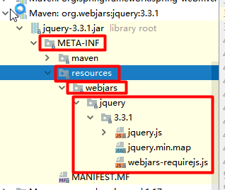

# SpringBoot-Learning


## SpringBoot Web开发

### 1、简介

使用SpringBoot;

**1）、创建SpringBoot应用，选中我们需要的模块；**

**2）、SpringBoot已经默认将这些场景配置好了，只需要在配置文件中指定少量配置就可以运行起来**

**3）、编写自己的业务代码**


**自动配置原理？**

这个场景SpringBoot帮 我们配置了什么？能不能修改？能修改哪些配置？能不能扩展？xxx

```xml
xxxAutoConfiguration：帮我们给容器中自动配置组件；
xxxProperties：配置类来封装配置文件的内容；
```


### 2、SpringBoot对静态资源的映射规则

```java

@ConfigurationProperties(
    prefix = "spring.resources",
    ignoreUnknownFields = false
)
public class ResourceProperties implements ResourceLoaderAware, InitializingBean {
    //可以设置和静态资源有关的参数，缓存时间等
```


```java
	public void addResourceHandlers(ResourceHandlerRegistry registry) {
        if (!this.resourceProperties.isAddMappings()) {
            logger.debug("Default resource handling disabled");
        } else {
            Integer cachePeriod = this.resourceProperties.getCachePeriod();
            if (!registry.hasMappingForPattern("/webjars/**")) {
                            this.customizeResourceHandlerRegistration(registry.addResourceHandler(new String[]{"/webjars/**"}).addResourceLocations(new String[]{"classpath:/META-INF/resources/webjars/"}).setCachePeriod(cachePeriod));
            }

            String staticPathPattern = this.mvcProperties.getStaticPathPattern();
            //静态资源文件夹映射
            if (!registry.hasMappingForPattern(staticPathPattern)) {
                this.customizeResourceHandlerRegistration(registry.addResourceHandler(new String[]{staticPathPattern}).addResourceLocations(this.resourceProperties.getStaticLocations()).setCachePeriod(cachePeriod));
            }

        }
    }

	//配置欢迎页映射
    @Bean
    public WebMvcAutoConfiguration.WelcomePageHandlerMapping welcomePageHandlerMapping(ResourceProperties resourceProperties) {
        return new WebMvcAutoConfiguration.WelcomePageHandlerMapping(resourceProperties.getWelcomePage(), this.mvcProperties.getStaticPathPattern());
    }

	//配置喜欢的图标
    @Configuration
    @ConditionalOnProperty(
        value = {"spring.mvc.favicon.enabled"},
        matchIfMissing = true
    )
    public static class FaviconConfiguration {
        private final ResourceProperties resourceProperties;

        public FaviconConfiguration(ResourceProperties resourceProperties) {
            this.resourceProperties = resourceProperties;
        }

        @Bean
        public SimpleUrlHandlerMapping faviconHandlerMapping() {
            SimpleUrlHandlerMapping mapping = new SimpleUrlHandlerMapping();
            mapping.setOrder(-2147483647);
            //所有  **/favicon.ico
            mapping.setUrlMap(Collections.singletonMap("**/favicon.ico", this.faviconRequestHandler()));
            return mapping;
        }

        @Bean
        public ResourceHttpRequestHandler faviconRequestHandler() {
            ResourceHttpRequestHandler requestHandler = new ResourceHttpRequestHandler();
            requestHandler.setLocations(this.resourceProperties.getFaviconLocations());
            return requestHandler;
        }
    }
```


==1）、所有/webjars/**，都去classpath:/META-INF/resources/webjars/找资源；==

​	webjars：以jar包的方式引入静态资源；

https://www.webjars.org/



localhost:8080/webjars/jquery/3.3.1/jquery.js


```xml
<!--引入jquery-webjar-->
        <dependency>
            <groupId>org.webjars</groupId>
            <artifactId>jquery</artifactId>
            <version>3.3.1</version>
        </dependency>
```


==2）、"/**"访问当前项目的任何资源，（静态资源的文件夹）==

```
"classpath:/META-INF/resources/", 
"classpath:/resources/", 
"classpath:/static/", 
"classpath:/public/"
"/"：当前项目的根路径
```

localhost:8080/abc === 去静态资源文件夹里面找abc


==3)、欢迎页；静态资源文件夹下的所有index.html页面；被"/**"映射；==

​	localhost:8080/    找index页面

==4)、所有的  **/favicon.ico  都是在静态资源文件夹下找；==


### 3、模板引擎

JSP、Velocity、Freemarker、Thymeleaf；


SpringBoot推荐的Thymeleaf；

语法更简单，功能更强大；


#### 1、引入thymeleaf；

```xml
    <dependency>
        <groupId>org.springframework.boot</groupId>
        <artifactId>spring-boot-starter-thymeleaf</artifactId>
        2.1.6
    </dependency>

切换thymeleaf版本
	<properties>  
 		<!--使用thymeleaf的版本3-->
        <thymeleaf.version>3.0.9.RELEASE</thymeleaf.version>
        <!--布局功能的支持程序， thymeleaf 3主程序 layout 2以上版本-->
        <!-- themeleaf 2 对应 layout 1-->
        <thymeleaf-layout-dialect.version>2.2.2</thymeleaf-layout-dialect.version>
	</properties>
```


